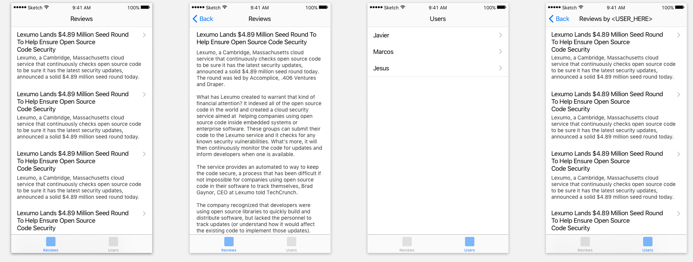

# Book Review App
This app needs a bit of work we have a `UITabBarController` for navigation but we're missing the UI and Networking code. We want to show `Review`'s in one tab and `User`'s in the other. I added some more info on how the app should function below. In addition I've attached a few screenshots in the `/UI` directory for you to implement. There is also a Sketch file included if you prefer that.

# Why

This small test is to see where you stand on building out features and implementing design. A lot is left unsaid but the objective is clear. You'll be tested on how you get the objective laid out below. So it's very important to stay with in the best practices of iOS and software engineering in general.

# Requirements

* Use Autolayout and size classes for views.
* Design for iPhone only

# HTTP Endpoints
`http://jsonplaceholder.typicode.com/users`
`http://jsonplaceholder.typicode.com/users/<user_id>`
`http://jsonplaceholder.typicode.com/users/<user_id>/posts`
`http://jsonplaceholder.typicode.com/posts`
`http://jsonplaceholder.typicode.com/posts/<post_id>`

# Reviews Tab
Add a `UIViewController` with a `UITableView`; embedded in a `UINavigationController` to the review. List all the `Review`'s in the tableview and when a cell is tapped (push) to a separate view showing the `Review` by itself. When displaying the selected review put that inside a `UITextView` on a separate view controller.

# Users Tab
This section is similar to `Review` with a few exceptions. Add a `UIViewController` with a `UITableView`; embedded in a `UINavigationController` to the review. List all the `User`'s in the tableview and when a cell is tapped (push) to a separate view showing the `Review`'s by the selected `User` itself.

# Questions
If something isn't clear please feel free to email me at [mreyes@blim.com](mailto:mreyes@blim.com)